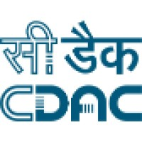

<html>
<head>
	<meta http-equiv="content-type" content="text/html; charset=utf-8"/>
	<title></title>
	<meta name="generator" content="LibreOffice 6.0.7.3 (Linux)"/>
	<meta name="created" content="2022-05-05T14:35:31.117835069"/>
	<meta name="changed" content="2022-05-05T14:48:01.952387795"/>
	
</head>
<body lang="en-IN" bgcolor="#d5e9ea" dir="ltr">

<b>Speech
Technologies in Indian Languages</b>

 
 

Speaker Recognition Project

Sponsored by MeiTY, Govt. of India

This web page is developed to provide a compilation of various user manuals and help materials
required in the development of the project.

<ul>
<li><a href="SRS.html" target="_blank">Software Requirement Specifications</a></li>
<li><a href="https://github.com/SR-MEiTY/i-SpeakR" target="_blank">i-SpeakR Toolkit Repository</a></li>
</ul>

<ul>
<li>Tutorials
<ul>
<li><a href="https://keras.io/examples/audio/speaker_recognition_using_cnn/" target="_blank">Keras Speaker Recognition</a></li>
<li><a href="https://dspace.mit.edu/handle/1721.1/70480" target="_blank">A Tutorial on Text-Independent Speaker Verification, MIT</a></li>
<li><a href="https://www.sciencedirect.com/science/article/pii/S0167639317302637" target="_blank">Speaker Recognition from Whispered Speech</a></li>
</ul>
</li>
</ul>

<ul>
<li>
<a href="Available_Toolkits.html" target="_blank">Other available toolkits Details</a>
<ul>
<li><a href="https://speechbrain.github.io/" target="_blank">Speech Brain</a></li>
<li><a href="https://www.idiap.ch/software/bob/docs/bob/bob.bio.spear/stable/index.html" target="_blank">Bob Spear</a></li>
<li><a href="https://alize.univ-avignon.fr/" target="_blank">ALIZÉ</a></li>
</ul>
</li>

</ul>

	
©
	Speaker Recognition Toolkit Development Team, IIT Dharwad.

</body>
</html>
